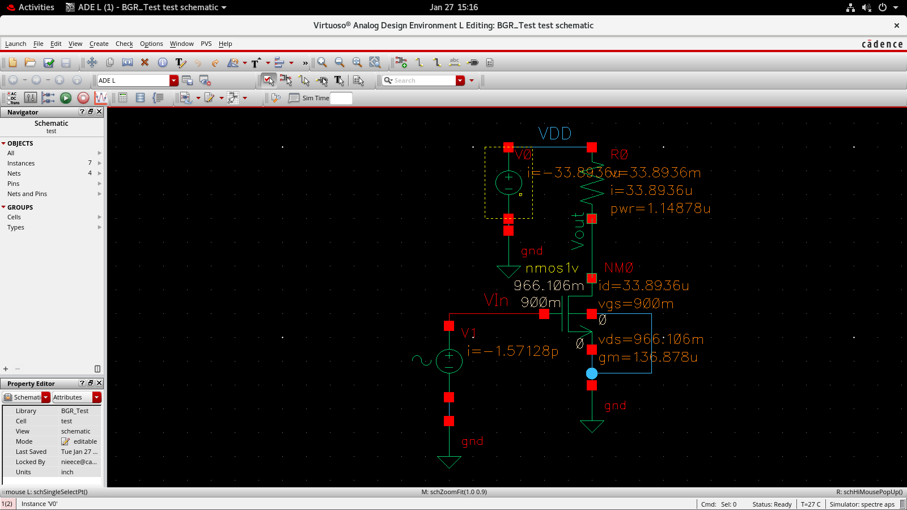
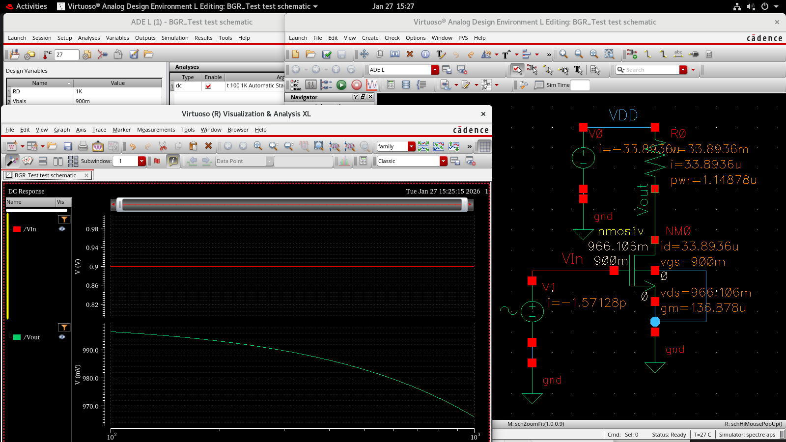
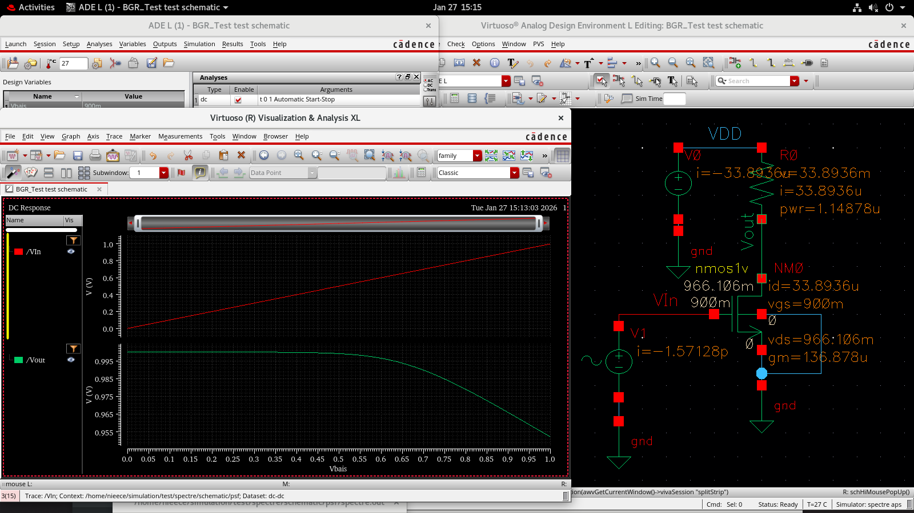
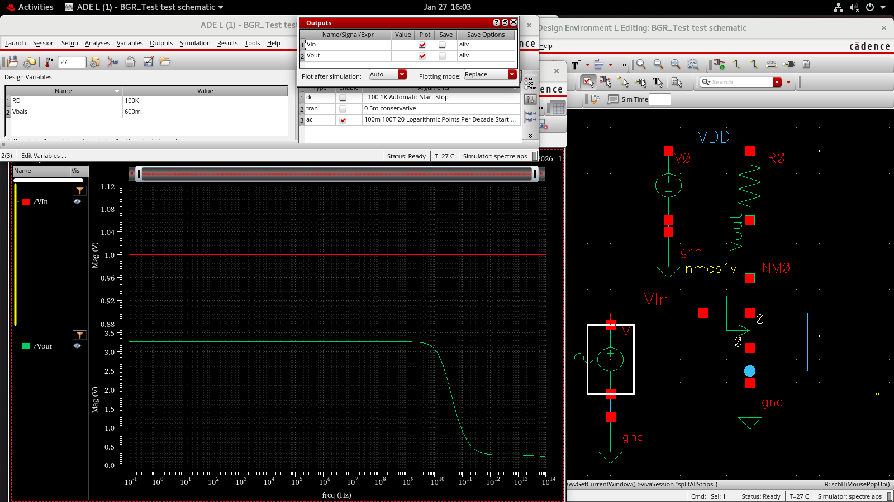
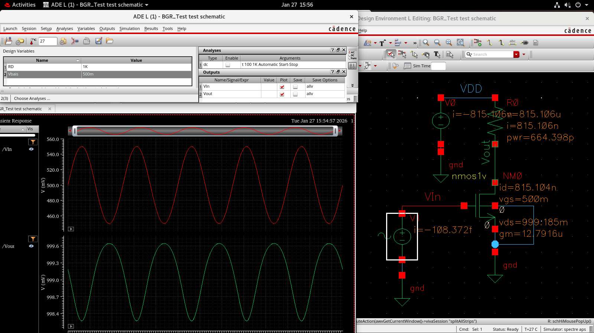
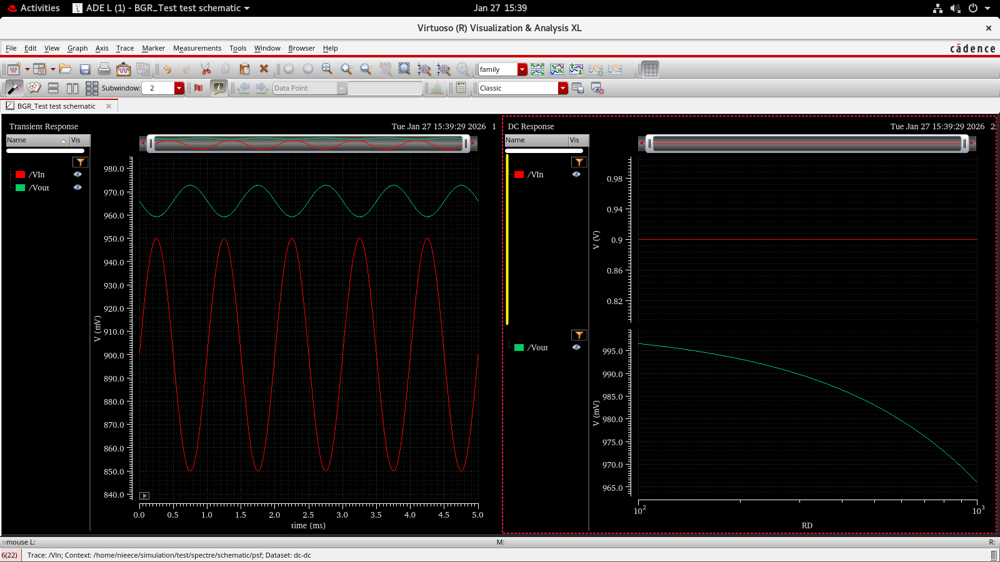
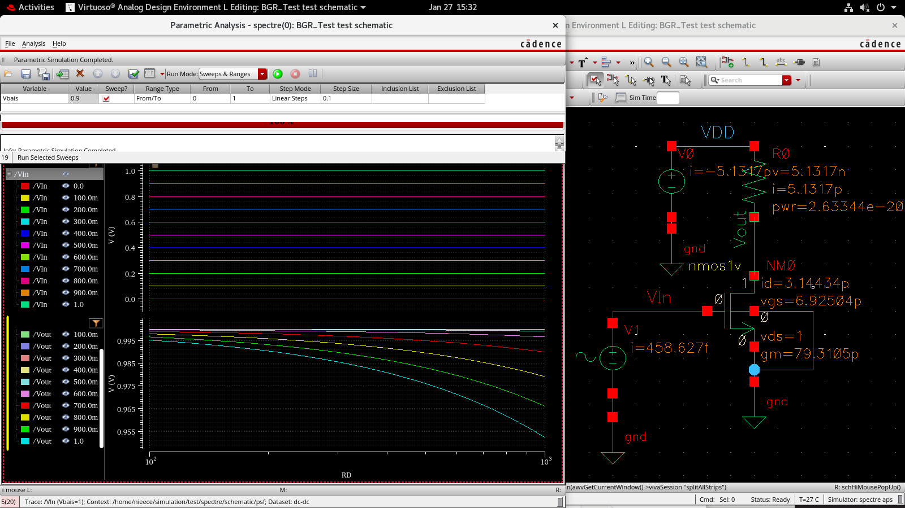
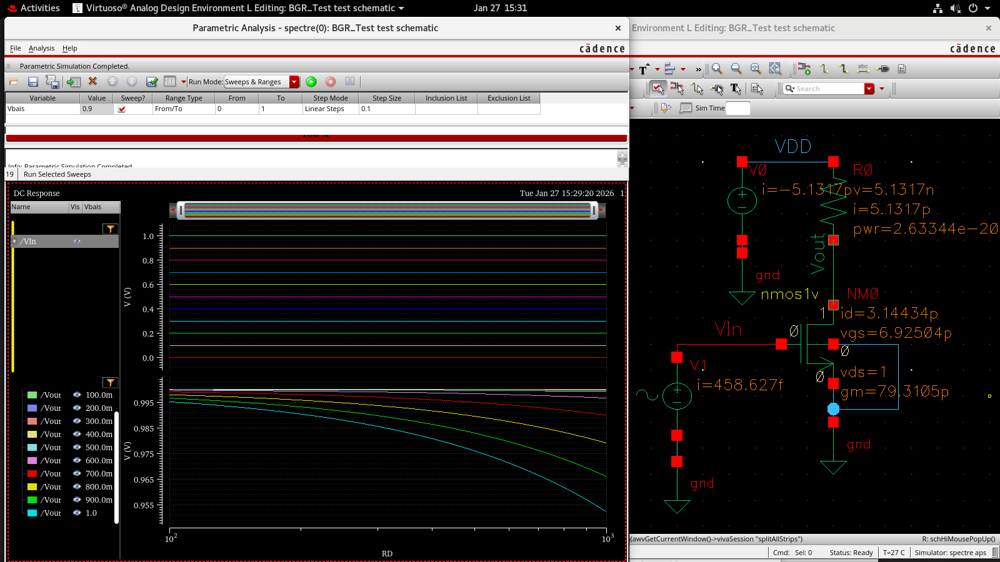
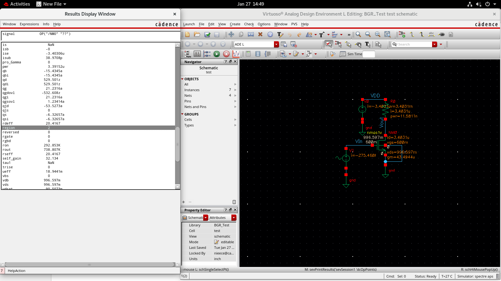
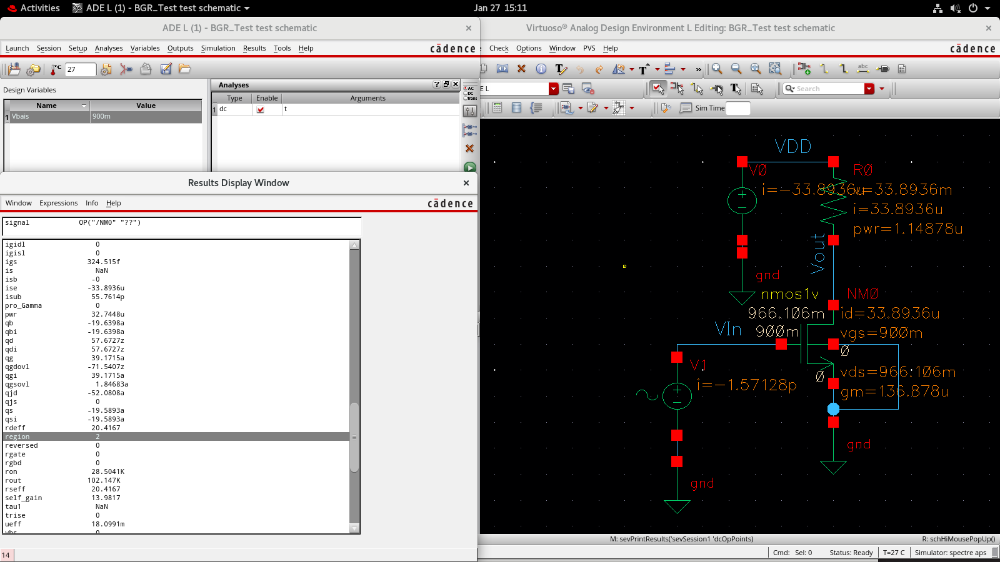

# BGR Test Analysis Images

This folder contains all simulation screenshots of the Bandgap Reference (BGR) circuit.

---

## Circuit Schematic

---

## DC Analysis

### DC Analysis

### DC Analysis (Alternative)

---

## AC Analysis

---

## Transient Analysis

---

## Transient vs DC Analysis

---

## Parametric Analysis

---

## Device Operating Region Analysis

### Cutoff Region (100 mV)

### Saturation Region (600 mV)

### Saturation Region (900 mV)

