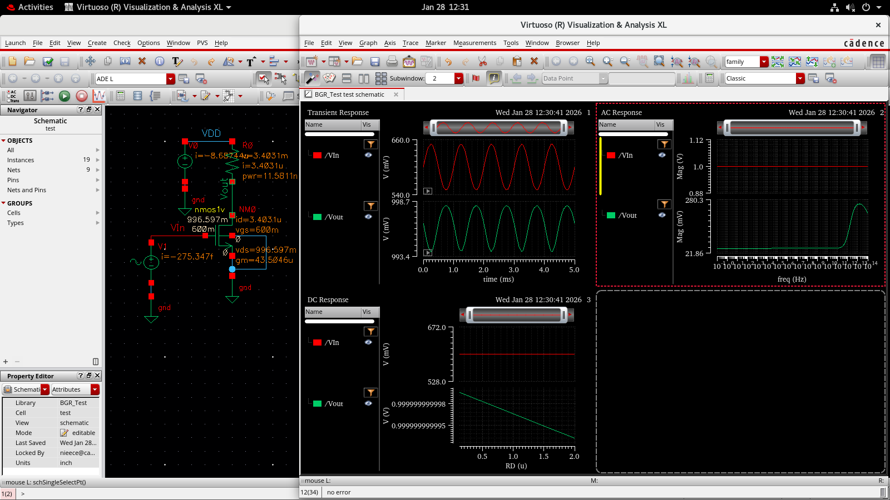
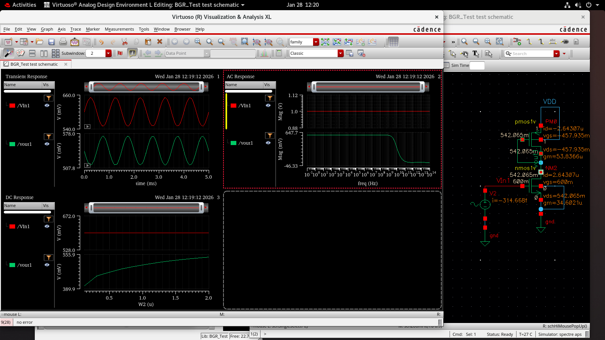
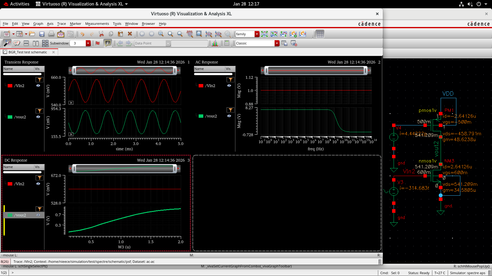
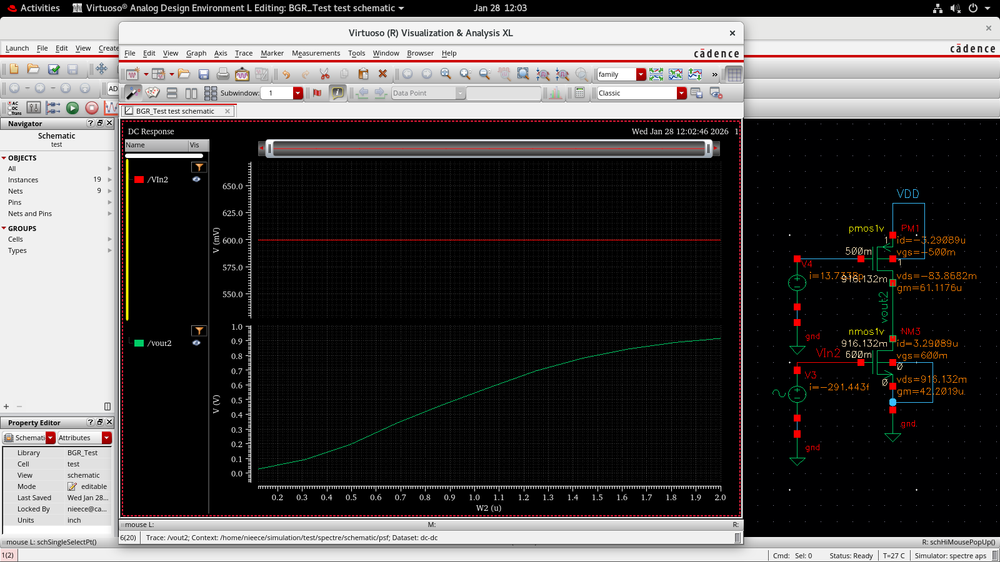
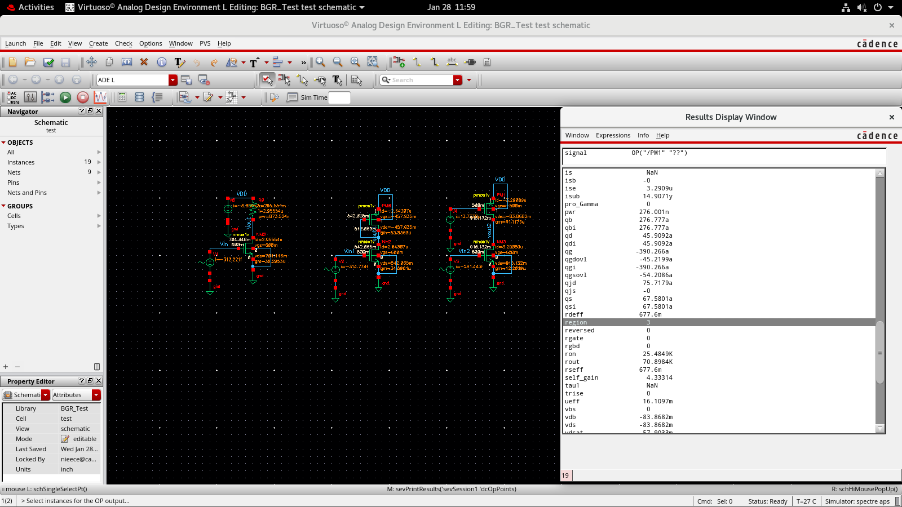
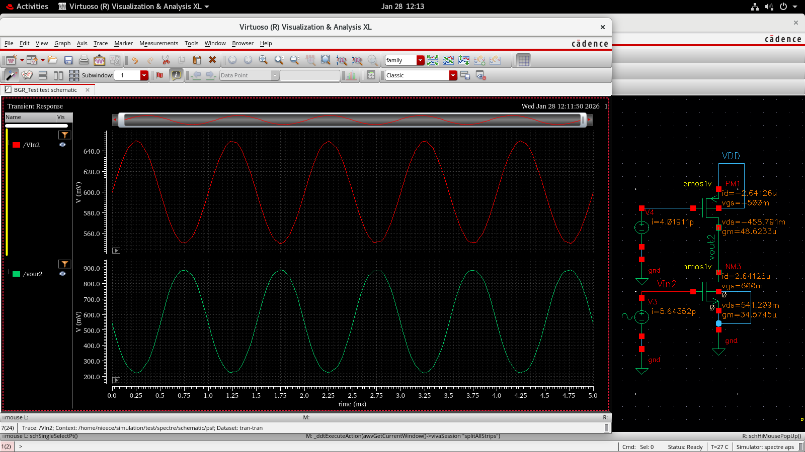
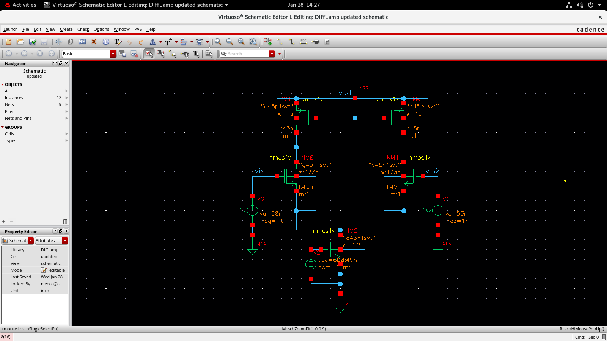
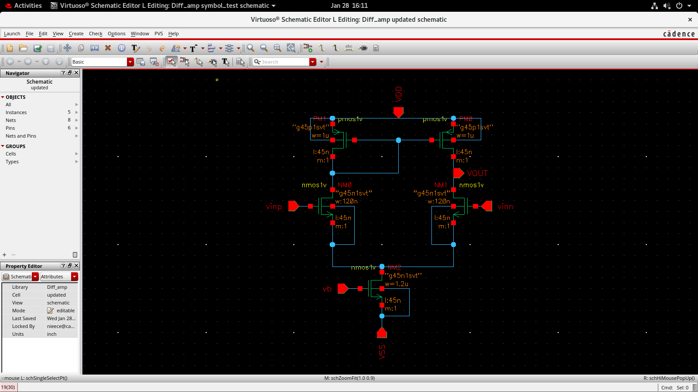
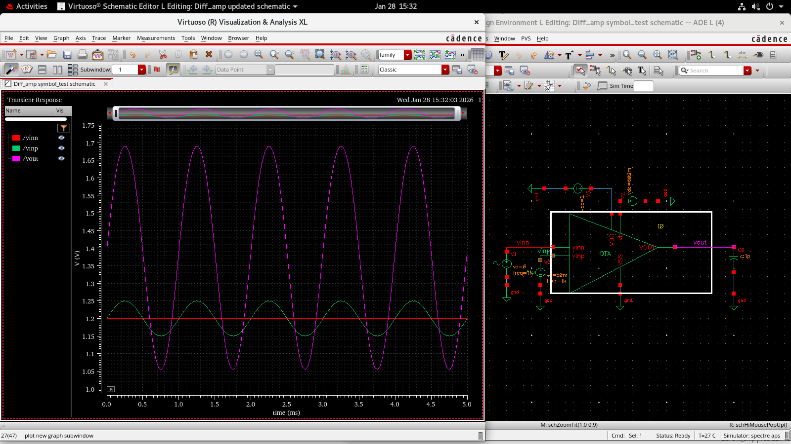

# 📘 Day 2 — Common Source Amplifier & Differential Amplifier Analysis
**Analog IC Design & Layout Considerations**

## 🎯 Objective
- Design and analyze **Common Source (CS) Amplifiers**
- Compare **three circuit variants** to study gain improvement
- Study **DC response, region of operation, and transient behavior**
- Design and simulate a **Differential Amplifier**
- Strengthen understanding of **MOSFET small-signal gain and biasing**

### 📌 Circuit 1 — Basic Common Source Amplifier
Initial implementation of a standard CS amplifier to observe baseline gain.
Here the size of the resistor is large and the gain is:

\[
A_v = -(g_m \times R_D)
\]

### 📌 Circuit 2 — Improved Gain Configuration
Modified transistor sizing / biasing to enhance gain performance.

We have replaced the resistor with a **diode-connected transistor**, which behaves as a current source.

Here the gain becomes:

\[
A_v = -\frac{g_{m1}}{g_{m2}}
\]

Yet, the gain is still not as desired.

### 📌 Circuit 3 — Optimized Gain Configuration
Final optimized CS amplifier with improved gain and operating region stability.

We now provide separate voltage sources to each MOSFET to obtain the desired gain.

## 📊 DC Gain Comparison Across Three Circuits

### 🔹 Gain for 120nm Channel Length

### 🔹 Gain for 1µm Channel Length

## 📐 Gain Equation Used

\[
A_v = -g_m \times R_D
\]

Where:

- \( g_m = \frac{2I_D}{V_{OV}} \)
- \( R_D \) = Drain resistance
- Negative sign indicates **phase inversion**

## 🔹 Region of Operation Verification (Circuit 3)

Ensured the MOSFET remains in the **saturation region** for maximum gain.

## ⏱ Transient Response — Circuit 3

Observed the time-domain amplification and signal behavior.

## 🧪 Three-Circuit Comparison Summary

| Circuit | Modification | Result |
|----------|-------------|--------|
| Circuit 1 | Basic CS | Low baseline gain |
| Circuit 2 | Improved biasing | Higher gain |
| Circuit 3 | Optimized sizing | **Best gain & stability** |

### 📌 Key Insight

- Gain improves with **higher \(g_m\)**
- Longer channel length increases **output resistance**
- Proper biasing ensures **stable saturation operation**

## 🔹 Part 2 — Differential Amplifier Design / Operational Transconductance Amplifier (OTA)

### 📌 Differential Amplifier Schematic

### 📌 Alternate Schematic View

### 📊 Differential Output Response

## 📐 Differential Gain Equation

\[
A_d = g_m \times R_D
\]

### Common Mode Rejection Ratio (CMRR)

\[
CMRR = \frac{A_d}{A_{cm}}
\]

## 🎓 Key Learnings

### Common Source Amplifier

- Gain depends on **\(g_m\)** and load resistance.
- Channel length affects **gain** and **output resistance**.
- Proper biasing determines the **region of operation**.
- Comparing multiple circuit variants helps optimize amplifier performance.

### Differential Amplifier

- Amplifies the **difference between two input signals**.
- Rejects **common-mode noise**, improving signal integrity.
- Forms the fundamental building block of **Operational Amplifiers (Op-Amps)** and many analog ICs.

## 🛠 Tools Used

- Cadence Virtuoso
- Spectre Simulator
- Analog Design Environment (ADE)

## 📈 Outcome

Successfully designed and analyzed:

- **Three Common Source amplifier variants** with gain comparison.
- **A functional Differential Amplifier (OTA)**.
- Improved understanding of **analog gain, MOSFET biasing, saturation operation, and circuit optimization**.
